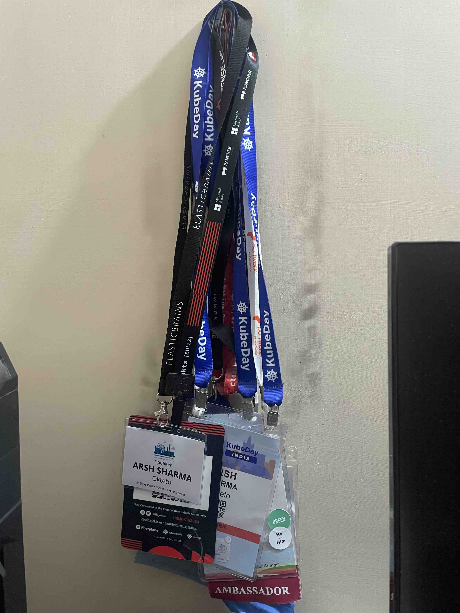
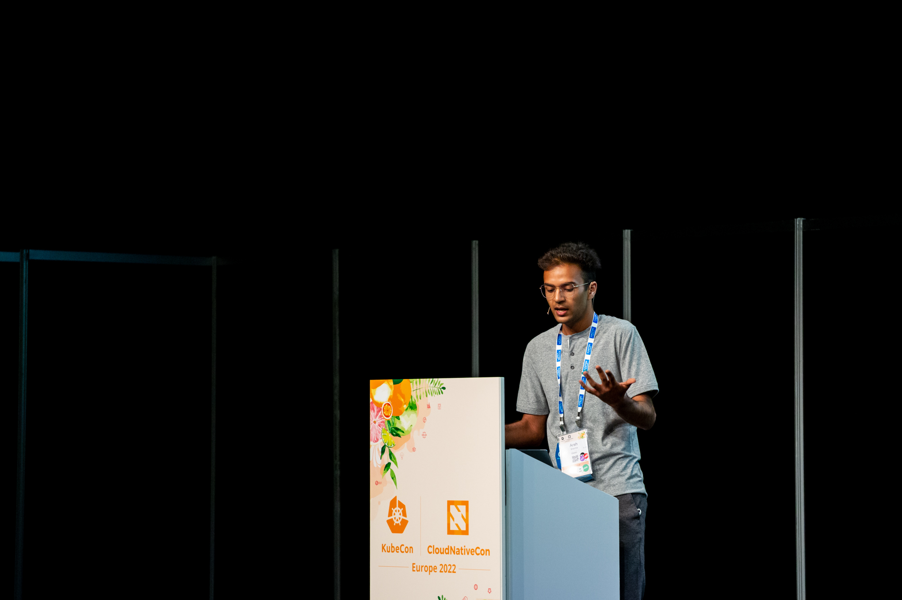
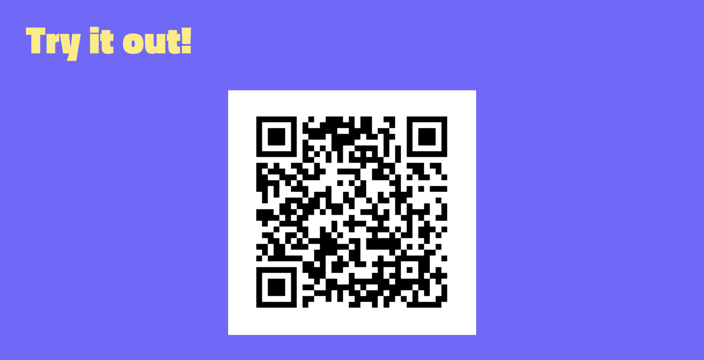

On the wall across from my desk, I've got badges from all the conferences I've been to. The collection has grown quite a bit over the past two years. Recently, taking a look at it made me take a trip down memory lane and reflect on the first few talks I gave, as well as the ones I'm giving now - what's changed, what I do differently, and the things I've learned. This blog is gonna be about some of those learnings.

## My First Conference Talk

The first time I spoke at an in-person conference was in May 2022 in Valencia at KubeCon Europe. I had spoken at a bunch of online conferences and webinars during the Covid lockdown, but never in person. And it was a big deal for me because it was at [KubeCon](https://events.linuxfoundation.org/kubecon-cloudnativecon-europe/)! I still remember how nervous I was walking up to that stage, seeing all the people filling up the room to hear our talk. I don't think anybody noticed, but my legs were seriously trembling. Part of it was the usual fear of public speaking that most people experience, but part of it was imposter syndrome. I had only been contributing to [Kubernetes](https://kubernetes.io/) for a year, and here were all these people who had been working with Kubernetes for so long, coming to listen to **me** talk? What if they find my talk irrelevant or already know everything I'm saying? What if I mess up and say something completely stupid on stage? What if they start thinking I'm a total hack and don't know anything?

I honestly can't remember how, but somehow I managed to push those thoughts away and just went for it on stage that day. I probably told myself that there was no turning back now, and that this was it. And you know what? It turned out pretty great!

> A photo from my first conference talk. Yes I was really skinny back then xD

After the talk, people actually came up to us and said they learned a lot from it! We had some interesting conversations, and they even shared their own struggles with the [tool I was discussing](https://www.youtube.com/watch?v=sdU-3cqiJmg). I could relate to them, and it felt really good. Turns out, I didn't embarrass myself as much as I thought I would. No one thought I didn't belong or didn't know anything. The world didn't end, and everything was just fine :)

So, I did it again. And again. [And again](https://arshsharma.com/speaking/). Since then, I've had the privilege of speaking at several conferences and meetups. I'm really grateful for that exposure. Now, I can confidently say that my legs no longer shake (sometimes?) when I have to go up on stage. But for those of you who are just starting out, here are some things I learned the hard way that I wish I knew earlier. Just a heads up, these are based on my personal experience speaking at tech conferences. Don't take them as absolute truths :))

## Code Is Forgotten, Stories Are Remembered

I put this first because it's been my biggest learning this year. When I started giving talks, I used to include a lot of code and technical details. I think part of that was because of imposter syndrome. I felt like I had to appear "smart" for people to listen to me. But I've realized how silly that was. While the topics I talk about today are still technical, I've learned that the main purpose of technology is solving problems, and that's what people want to hear about. Stories about the problems you're trying to solve, and why solving them is important, resonate more with attendees than lines of code. If they get inspired by the problem your tool solves, you can always talk about the implementation later :)

I've also started applying this approach to demos. Before, I used to show every single step maybe in an attempt to prove that I know what I'm talking about. But I've realized that it only dilutes the demos. Attention spans are limited, and when there are so many moving pieces, people lose track. So now, while I provide detailed steps and instructions in a README, I focus my demo on highlighting the "wow" moment - the moment that captures everyone's attention and connects the demo to the pain point mentioned in the story.

People want to be heard, to see themselves in stories and struggles. They want to relate. As a speaker, it's your job to try and inspire them. In retrospect, this is something I should've learned way earlier, because many conversations I had after my talks were not about the code I showed, but about how people struggled to find similar solutions or the problems they faced when trying to implement them.

## Everyone Is Unique, and That Makes Your Story More Valuable Than You Might Think!

I feel like this applies more to life in general than just conference speaking. Realizing that even though there may be more experienced people in the room, they haven't had the same set of experiences as me, helped me overcome my imposter syndrome a lot. The beauty of life is that everyone has a unique story and a unique understanding of different things based on their life experiences. So, the best way to keep your talk interesting is by being yourself! Tell your story in your own way.

Oh, and here's another thing to keep in mind. People attend conferences to be exposed to new ideas and things. Sure, they might be subject matter experts on topic A and have decades more experience than you, but that doesn't mean they might be equally knowledgeable about the topic you're presenting.

Sometimes, we get so caught up in our own little bubble, working on that one thing with our colleagues, and assume that everyone knows about it. But trust me, that's almost never the case. For example, in one of my recent talks, we were discussing DevX. Since that's what I mainly focus on in my day job, I was very familiar with it. But when I asked the audience to show hands, turns out 70% of them weren't familiar with it. Lesson learned? It's easy to fall into a silo and assume everyone knows what you're talking about, but don't let that imposter syndrome get the best of you!

You're unique, your story is unique, and the way you tell it will be unique too. So, you have a lot of value to offer. Just go out there and be yourself! :)

## Your Slides Don't Matter...

...as much as you think. Now that I have your attention with a provocative heading, let me clarify. Of course, your slides matter and they're an important visual aid to complement your talk. But they shouldn't steal the spotlight. Avoid turning your slides into a word-for-word script or a list of lengthy bullet points.

I used to cram my slide with bullet points, but that just diverted attention. The key is to keep the focus on what you're saying. Slides should simply support your storytelling process, nothing more. Throw in some GIFs, ask questions, and if you have to include text, keep it short and bold the important stuff.

> A slide from one of my recent talks, made with Deckset.

One tool I've grown fond of is [Deckset](https://www.deckset.com/). It really helps me think about my slides in the way I talked about above. Plus, keeping my slides short has pushed me to practice my content more. It makes me more flexible to adjust based on audience response rather than sticking to a rigid script.

## Keep It Interactive

If you're speaking for more than 30 minutes, it's really easy to lose people's attention. That's why it's very important to make your talks interactive. How do you do that? Well, start by asking questions. Get the audience involved by asking them to raise their hands in response to a question. Throw in a few jokes here and there. Another thing I've learned is to make my demos as interactive as possible. For instance, I often use a todo list app for my demos and I deploy a live copy of it. I ask the audience to scan the QR code so they can see the app live and add todos to it.

Think about how you can make your presentation engaging and make the attendees feel like they're part of the talk, rather than just passive listeners!

## And Lastly, Remember to Breathe and Have Fun!

I had a habit of rushing and talking non-stop when giving talks. Silences made me uncomfortable. But now I make sure to take a moment and add some pauses to my talks. Because I've learned that not only does it give the attendees time to process, but it also helps you collect your thoughts. Look at the attendees and try to read the room - see if they're following what you're talking about or not. If they're finding it hard to follow, don't hesitate to repeat things and give more examples. 

Lastly and most importantly, don't forget to have fun! You've got a platform to share your knowledge and inspire others, so make the most of it and enjoy the experience. Engage with the attendees, throw in some questions, take breaks for laughter, and don't take yourself too seriously. Treat every talk as a learning experience, so no matter how it goes, use it to improve and do better for your next one. And above all, believe in yourself and your **unique** story. You've got this :)

If you like my articles, you can follow me on [Twitter](https://twitter.com/RinkiyaKeDad) or [LinkedIn](https://www.linkedin.com/in/arsh4/) to get notified whenever I post something new!